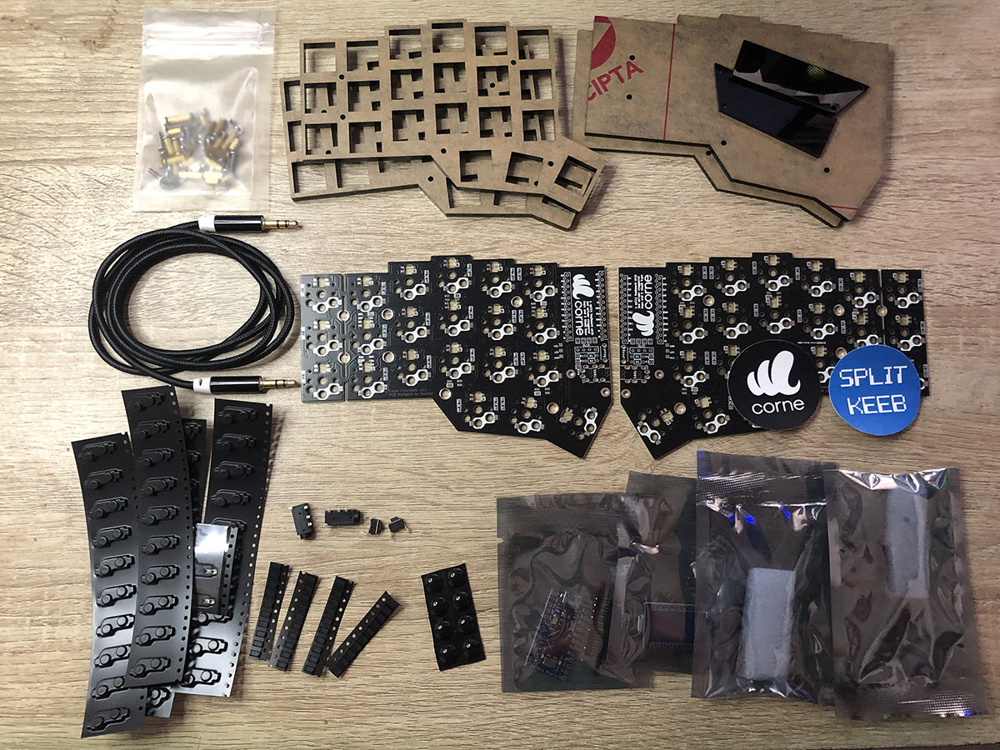

# Split Keeb Inventory Management App

<p align="center">
  
  <p style="text-align: center;"><i>Corne Chocolate Low Profile Keyboard</i></p>  
</p>

Split Keeb is my small business for selling split mechanial keyboards like [CRKBD](https://github.com/foostan/crkbd). This app was about the spareparts inventory management app. To show me the spare part remain in the inventory, reorder reminder, spare part out, build logs, and the summary of how much I have spent on the materials and how much I have earned from the product sellings since the business is starting.

This project was build using Python Django.

So, here's are few step you can follow if you want to running the app by your self, or just testing it.

### 1. Clone this repo

Make sure you already have installed git in your machine, you can check it by typing `git --version` on your terminal. If not, you can download the git or download this project as a zip file.

```
git --version
```

### 2. Install the dependencies

If you already have the project files on your directory, next is to install all dependencies using python `PIP`.

```
pip install -r requirements.txt
```

### 3. Run Database Migration

To make the database work you should run the django migration by typing command below on your terminal

```
python manage.py migrate
```

or

```
python3 manage.py migrate
```

Output:

```
Operations to perform:
  Apply all migrations: admin, auth, build_log, contenttypes, sessions, spareparts
Running migrations:
  Applying contenttypes.0001_initial... OK
  Applying auth.0001_initial... OK
  Applying admin.0001_initial... OK
  Applying admin.0002_logentry_remove_auto_add... OK
  Applying admin.0003_logentry_add_action_flag_choices... OK
  Applying contenttypes.0002_remove_content_type_name... OK
  Applying auth.0002_alter_permission_name_max_length... OK
  Applying auth.0003_alter_user_email_max_length... OK
  Applying auth.0004_alter_user_username_opts... OK
  Applying auth.0005_alter_user_last_login_null... OK
  Applying auth.0006_require_contenttypes_0002... OK
  Applying auth.0007_alter_validators_add_error_messages... OK
  Applying auth.0008_alter_user_username_max_length... OK
  Applying auth.0009_alter_user_last_name_max_length... OK
  Applying auth.0010_alter_group_name_max_length... OK
  Applying auth.0011_update_proxy_permissions... OK
  Applying auth.0012_alter_user_first_name_max_length... OK
  Applying spareparts.0001_initial... OK
  Applying build_log.0001_initial... OK
  Applying sessions.0001_initial... OK
```

### 4. Run the Server

One last step, run the app on your machine by typing command below

```
python manage.py runserver 8000
```

or

```
python3 manage.py runserver 8000
```

If port 8000 is doesn't work for you can change it with 5000 or any number you like.

### App Pages

Home Page | Order Table
:-------------------------:|:-------------------------:
|